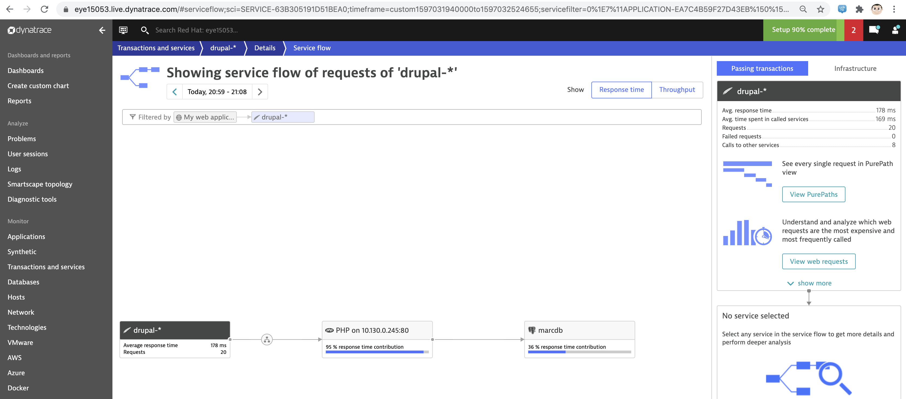
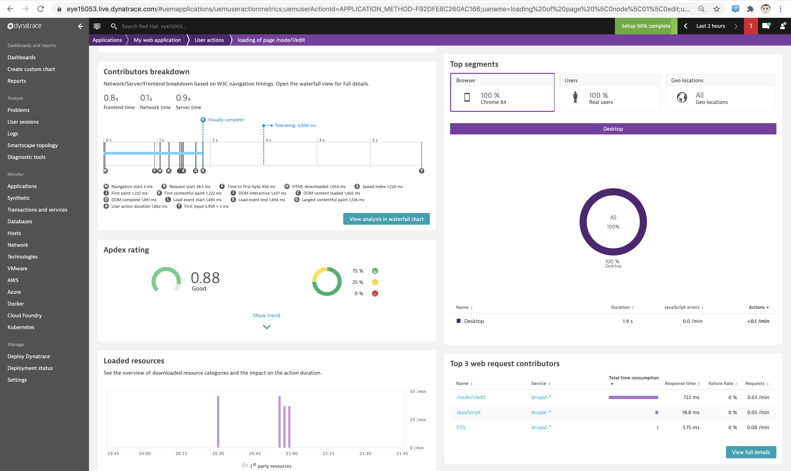
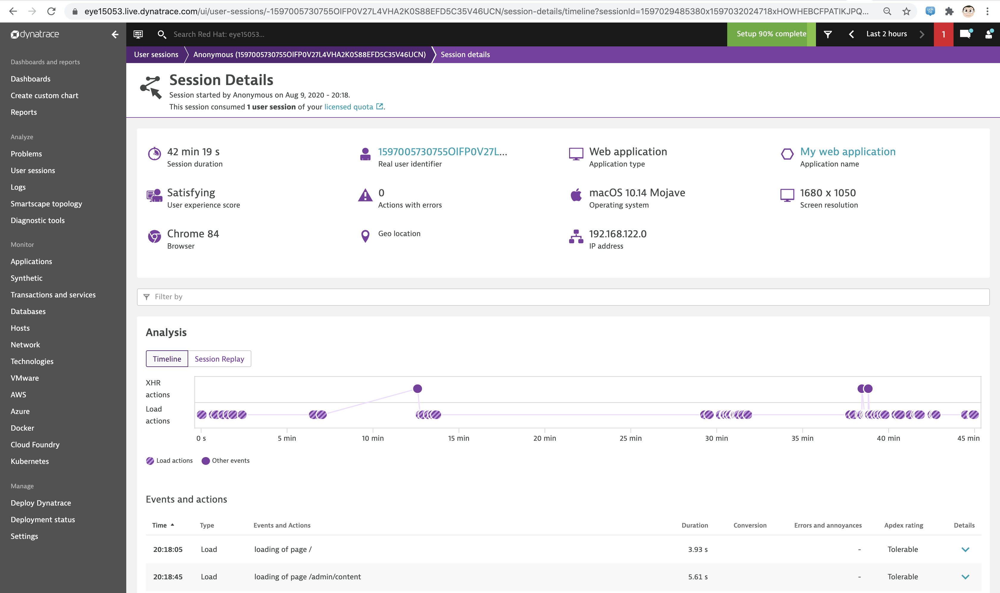
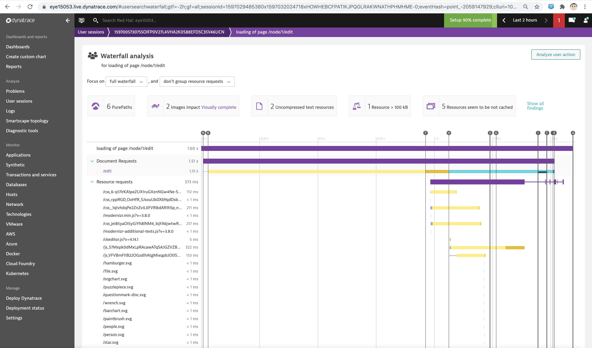
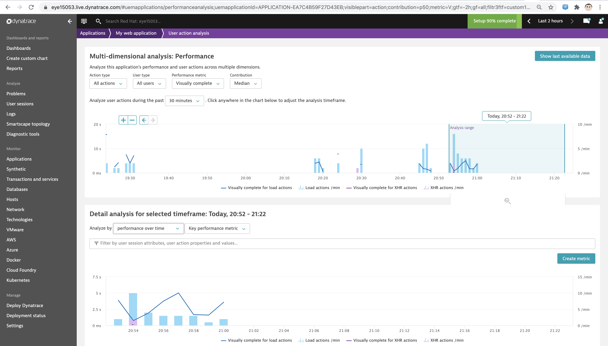
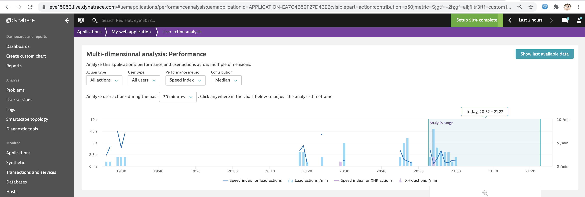
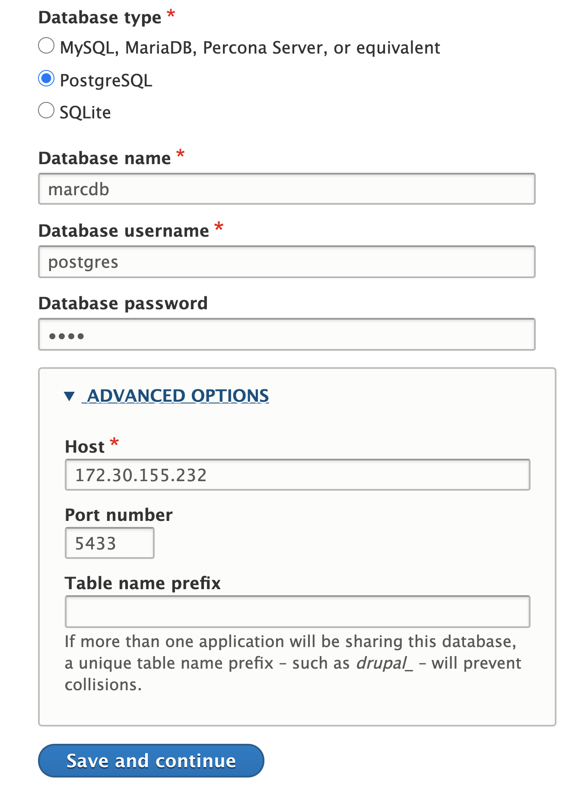
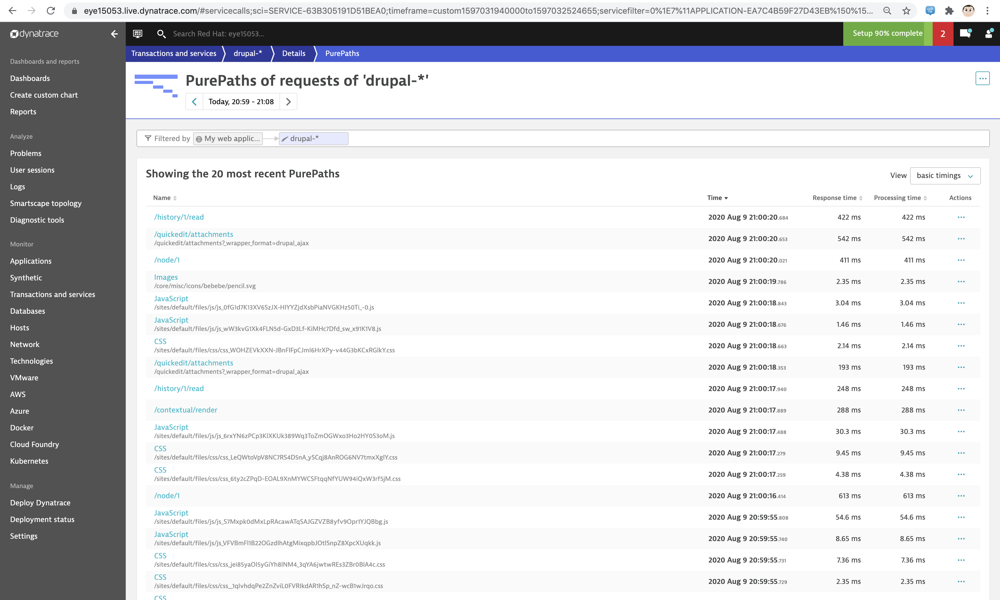

== Dynatrace real user monitoring on OpenShift 4.4+; Dynatrace Visually complete and Speed index

== This lab: Drupal 9.0.3 with AMP module and PostgreSQL 12.3 backend on OpenShift 4.4

In this lab, we'll use Dynatrace to see and capture the visual experience of a real user 

----
We'll see the complete picture, from the frontend to the backend.
----

----
Understand performance issues:
----

----
Visually complete measures exactly how long it takes your web page to become fully loaded visually and ready to be used:
----

----
Speed index indicates how fast your page loads through a user's perspective:
----

----
Let's get to work!
----

----
oc new-project drupal
git clone https://github.com/marcredhat/drupal-on-kubernetes-sample
cd drupal-on-kubernetes-sample/kubernetes/
oc create -f local-volumes.yaml
oc create -f postgres.yaml
oc create -f drupal.yaml
----

----
oc get pvc
NAME             STATUS   VOLUME           CAPACITY   ACCESS MODES   STORAGECLASS   AGE
drupal-claim     Bound    local-volume-1   10Gi       RWO                           9s
postgres-claim   Bound    local-volume-3   10Gi       RWO                           13s
----

----
oc get pods
NAME                         READY   STATUS    RESTARTS   AGE
drupal-588fdc7c99-5wr6l      1/1     Running   0          69s
postgresql-57cc99864-b6qs2   1/1     Running   0          73s
----

----
oc get svc
NAME         TYPE        CLUSTER-IP      EXTERNAL-IP   PORT(S)        AGE
drupal       NodePort    172.30.38.209   <none>        80:30080/TCP   81s
postgresql   ClusterIP   172.30.111.10   <none>        5432/TCP       85s
----

----
oc expose svc drupal
route.route.openshift.io/drupal exposed
----

----
oc get route
NAME     HOST/PORT                       PATH   SERVICES   PORT   TERMINATION   WILDCARD
drupal   drupal-drupal.apps.ocp4.local          drupal     80                   None
----

----
oc rsh postgresql-57cc99864-b6qs2
# su postgres
postgres@postgresql-57cc99864-b6qs2:/$ pg_createcluster 12  main --start
Creating new PostgreSQL cluster 12/main ...
/usr/lib/postgresql/12/bin/initdb -D /var/lib/postgresql/12/main --auth-local peer --auth-host md5
The files belonging to this database system will be owned by user "postgres".
This user must also own the server process.

The database cluster will be initialized with locale "en_US.utf8".
The default database encoding has accordingly been set to "UTF8".
The default text search configuration will be set to "english".

Data page checksums are disabled.

fixing permissions on existing directory /var/lib/postgresql/12/main ... ok
creating subdirectories ... ok
selecting dynamic shared memory implementation ... posix
selecting default max_connections ... 100
selecting default shared_buffers ... 128MB
selecting default time zone ... Etc/UTC
creating configuration files ... ok
running bootstrap script ... ok
performing post-bootstrap initialization ... ok
syncing data to disk ... ok

Success. You can now start the database server using:

    pg_ctlcluster 12 main start

Ver Cluster Port Status Owner    Data directory              Log file
12  main    5433 online postgres /var/lib/postgresql/12/main /var/log/postgresql/postgresql-12-main.log
----

NOTE: Check the PostgreSQL port as follows and ensure it's the same as the port configured for the OpenShift service

----
postgres@postgresql-57cc99864-b6qs2:/$ /etc/init.d/postgresql restart
[....] Restarting PostgreSQL 12 database server: main
. ok
postgres@postgresql-57cc99864-b6qs2:/$ /etc/init.d/postgresql status
12/main (port 5433): online
----

NOTE: In my case, it's not so I'll recreate the OpenShift service to use the correct port 

----
oc delete svc  postgresql
service "postgresql" deleted
oc expose deployment postgresql --port 5433
service/postgresql exposed
----

== Create user 

----
oc rsh postgresql-57cc99864-b6qs2
# su postgres
postgres@postgresql-57cc99864-b6qs2:/$ createuser --pwprompt --encrypted --no-adduser --no-createdb marc
Enter password for new role:
Enter it again:
----

== Create database 

----
postgres@postgresql-57cc99864-b6qs2:/$ createdb --encoding=UNICODE --owner=marc marcdb
----

----
Browse to http://drupal-drupal.apps.ocp4.local/ and
start configuring your the database connection as shown in the image below
----

NOTE: "Host" is the value returned by "oc get service postgresql"

NOTE: You'll run into SQLSTATE[08006] [7] FATAL: no pg_hba.conf entry for host "10.130.0.245", user "marc", database "marcdb", SSL on FATAL: no pg_hba.conf entry for host "10.130.0.245", user "marc", database "marcdb", SSL off.

----
Copy the pg_hba.conf from the PostgreSQL container to your local machine
oc rsync postgresql-57cc99864-c2fcg:/etc/postgresql/12/main/pg_hba.conf .

Add a line in pg_hba.conf to allow connections from 10.130.0.245. e.g
host    all		all             10.130.0.0/16		trust

Transfer the updated pg_hba.conf the PostgreSQL container.
In my case, the file is in a folder named "copy" on my local machine.
Just as with UNIX rsync, if the directory name ends in a path separator ('/'), only the contents of the directory are copied to the destination

oc rsync copy/  postgresql-57cc99864-c2fcg:/etc/postgresql/12/main/
----

----
oc rsh postgresql-57cc99864-b6qs2
chmod 777 /etc/postgresql/12/main/pg_hba.conf
----

----
/etc/init.d/postgresql restart
/etc/init.d/postgresql status
----

== Install the Drupal AMP module

----
oc rsh drupal-588fdc7c99-5wr6l
# useradd -m -d /home/marc marc
# passwd marc
New password:
Retype new password:
passwd: password updated successfully
----

Check the latest release at https://www.drupal.org/project/amp/releases

----
oc rsh drupal-588fdc7c99-5wr6l
# composer require 'drupal/amp:^3.4'
Do not run Composer as root/super user! See https://getcomposer.org/root for details
./composer.json has been updated
Loading composer repositories with package information
Updating dependencies (including require-dev)
----

----
#http://drupal-drupal.apps.ocp4.local/admin/modules/install
----

== Links 

https://www.specbee.com/blogs/AMP-It-up-the-why-and-how-of-drupal-AMP-and-what-it-can-do-to-your-website

https://www.dynatrace.com/platform/real-user-monitoring/

https://www.dynatrace.com/platform/digital-experience-monitoring/visually-complete/

https://www.drupal.org/docs/creating-custom-modules/adding-stylesheets-css-and-javascript-js-to-a-drupal-module

https://medium.com/@rikdeboer/how-to-dynamically-embed-javascript-in-drupal-anywhere-on-any-page-3f9cd7e64d0c

https://www.drupal.org/docs/installing-drupal/drupal-quick-start-command
