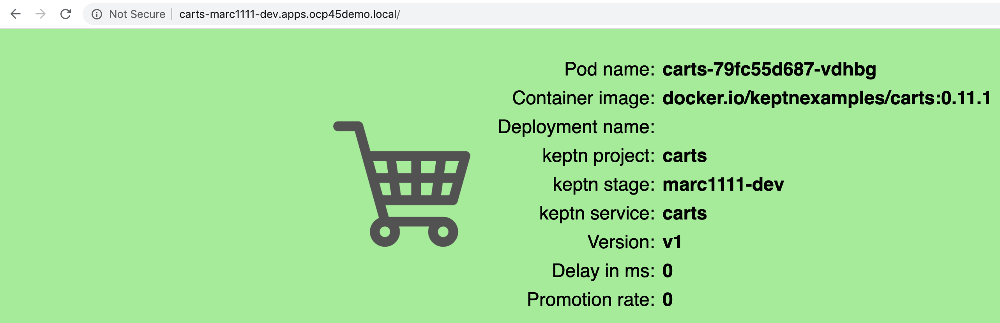
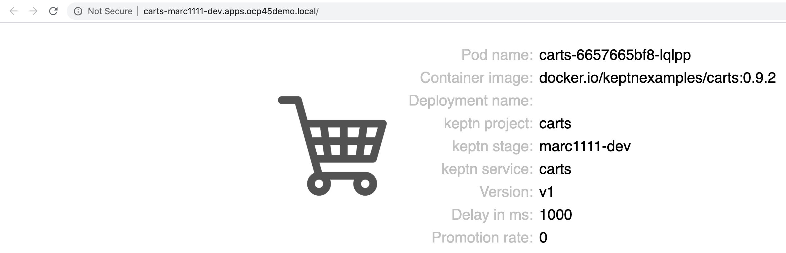

== Keptn - event-based control plane for continuous delivery and automated operations for cloud-native applications
----
mkdir keptn
oc new-project keptn
oc project keptn
curl -sL https://get.keptn.sh | sudo -E bash
----

See https://github.com/marcredhat/dynatrace/blob/master/servicemesh.adoc

----
Deploy OpenShift Service Mesh in the istio-system project
----

----
oc adm policy add-cluster-role-to-user cluster-admin  system:serviceaccount:keptn:default
oc adm policy add-cluster-role-to-user cluster-admin  system:serviceaccount:keptn-configuration-service
oc adm policy add-cluster-role-to-user cluster-admin  system:serviceaccount:keptn:builder                       
oc adm policy add-cluster-role-to-user cluster-admin  system:serviceaccount:keptn:keptn-default                       
oc adm policy add-cluster-role-to-user cluster-admin  system:serviceaccount:keptn:deployer                      
oc adm policy add-cluster-role-to-user cluster-admin  system:serviceaccount:keptn:keptn-api-service            
oc adm policy add-cluster-role-to-user cluster-admin  system:serviceaccount:keptn:keptn-helm-service            
oc adm policy add-cluster-role-to-user cluster-admin  system:serviceaccount:keptn:keptn-lighthouse-service
----

----
keptn install --use-case=continuous-delivery --platform=openshift  
keptn creates the folder /root/.keptn/ to store logs and possibly creds.
Helm Chart used for Keptn installation: https://storage.googleapis.com/keptn-installer/keptn-0.7.0.tgz
Installing Keptn ...
Please enter the following information or press enter to keep the old value:
Openshift Server URL []: https://api.ocp4.local:6443
....
Using a file-based storage for the key because the password-store seems to be not set up.
Existing Keptn installation found in namespace keptn

Do you want to overwrite this installation? (y/n)
y
Start upgrading Helm Chart keptn in namespace: keptn
----

See https://tutorials.keptn.sh/tutorials/keptn-installation-openshift-07/index.html?index=..%2F..index#5

----
kubectl -n keptn port-forward service/api-gateway-nginx 8080:80 &
Forwarding from 127.0.0.1:8080 -> 8080
Forwarding from [::1]:8080 -> 8080
Handling connection for 8080
----

----
Keep the above window running and go back to your initial terminal window 
----

----
KEPTN_ENDPOINT=http://localhost:8080/api
KEPTN_API_TOKEN=$(kubectl get secret keptn-api-token -n keptn -ojsonpath={.data.keptn-api-token} | base64 --decode)
keptn auth --endpoint=$KEPTN_ENDPOINT --api-token=$KEPTN_API_TOKEN
Starting to authenticate
Successfully authenticated
Using a file-based storage for the key because the password-store seems to be not set up.
----

----
Write down the values returned by:
keptn configure bridge --output
----

----
user: keptn
password: <password>
----

----
Ensure that the terminal window with 
kubectl -n keptn port-forward service/api-gateway-nginx 8080:80
is still running, then

Browse to localhost:8080
----

----
DT_TENANT=eye15053.live.dynatrace.com
DT_API_TOKEN=<Dynatrace API token>
DT_PAAS_TOKEN=<Dynatrace PaaS token>
oc -n keptn create secret generic dynatrace --from-literal="DT_TENANT=$DT_TENANT" --from-literal="DT_API_TOKEN=$DT_API_TOKEN"  --from-literal="DT_PAAS_TOKEN=$DT_PAAS_TOKEN" --from-literal="KEPTN_API_URL=http://localhost:8080/api" --from-literal="KEPTN_API_TOKEN=$KEPTN_API_TOKEN" 
----

----
oc apply -f https://raw.githubusercontent.com/keptn-contrib/dynatrace-service/release-0.7.0/deploy/manifests/dynatrace-service/dynatrace-service.yaml
----

----
oc project
Using project "keptn" on server "https://api.ocp4.local:6443".
oc get pods
NAME                                            READY   STATUS    RESTARTS   AGE
api-gateway-nginx-5b865b66b8-9x988              1/1     Running   0          19m
api-service-6d86cb4f88-fqgvp                    1/1     Running   0          19m
bridge-6594f6b8c-hn4gm                          1/1     Running   0          19m
dynatrace-service-55dc8cf558-vfx79              1/1     Running   1          9s
dynatrace-service-distributor-f59bd95fb-hl2rz   1/1     Running   0          9s
eventbroker-go-5674d9646d-88tv5                 1/1     Running   0          19m
helm-service-85f8bf5fd6-wjlvn                   2/2     Running   2          19m
keptn-nats-cluster-0                            3/3     Running   0          19m
lighthouse-service-6d4b5dcd9-r5mrs              2/2     Running   2          19m
mongodb-datastore-647b5bc584-x88tg              2/2     Running   2          19m
remediation-service-cf4b7b97f-qlq5q             2/2     Running   2          19m
shipyard-service-5c98f89f4c-znscx               2/2     Running   2          19m
----

----
keptn configure monitoring dynatrace
----

----
Do a first commit to the project's ("https://github.com/<user>/marc1111.gitmarc1111" below) github repo:
touch README
git add README
git commit -m "initial commit"
git push origin master
----

----
git clone --branch release-0.7.0 https://github.com/keptn/examples.git --single-branch
cd examples/onboarding-carts
----

----
keptn create project marc1111 --shipyard ./shipyard.yaml --git-user= --git-token= --git-remote-url=https://github.com/<user>/marc1111.git
Starting to create project
Handling connection for 8080
ID of Keptn context: xxxx
Handling connection for 8080
Project marc1111 created
Stage dev created
Stage staging created
Stage production created
Shipyard successfully processed

keptn onboard service carts --project=marc1111 --chart=./carts
Starting to onboard service
Handling connection for 8080
ID of Keptn context: xxxx
Handling connection for 8080
Create umbrella Helm Chart for project marc1111
Creating new Keptn service carts in stage dev
Creating new Keptn service carts in stage staging
Service already exists

keptn add-resource --project=marc1111 --service=carts --stage=dev --resource=jmeter/load.jmx --resourceUri=jmeter/basiccheck.jmx
Adding resource jmeter/load.jmx to service carts in stage dev in project marc1111
Handling connection for 8080
Resource has been uploaded.

keptn send event new-artifact --project=marc1111 --service=carts --image=docker.io/keptnexamples/carts --tag=0.11.1
Starting to send a new-artifact-event to deploy the service carts in project marc1111 in version docker.io/keptnexamples/carts:0.11.1
Handling connection for 8080
ID of Keptn context: xxxx
Handling connection for 8080
Start updating chart carts of stage dev
Finished updating chart carts of stage dev
Start upgrading chart marc1111-dev-carts in namespace marc1111-dev
Finished upgrading chart marc1111-dev-carts in namespace marc1111-dev
Start upgrading chart marc1111-dev-carts-generated in namespace marc1111-dev
Finished upgrading chart marc1111-dev-carts-generated in namespace marc1111-dev

oc project marc1111-dev
Now using project "marc1111-dev" on server "https://api.apps.ocp45demo.local:6443".
[root@dell-r730-001 onboarding-carts]# oc get pods
NAME READY STATUS RESTARTS AGE
carts-79fc55d687-vdhbg 1/1 Running 0 3m5s
----

----
keptn onboard service carts-db --project=marc1111 --chart=./carts-db
keptn send event new-artifact --project=marc1111 --service=carts-db --image=mongo
----

----
oc project marc1111-dev
----

----
oc get pods
NAME                       READY   STATUS    RESTARTS   AGE
carts-79fc55d687-vdhbg     1/1     Running   0          3h39m
carts-db-b99744499-zp7zp   0/1     Pending   0          3m11s
[root@dell-r730-001 onboarding-carts]# oc get pvc
NAME                 STATUS    VOLUME   CAPACITY   ACCESS MODES   STORAGECLASS   AGE
carts-db-mongodata   Pending
----

----
See https://github.com/marcredhat/upi/blob/master/nfs/nfs.adoc

oc create -f - <<EOF
apiVersion: v1
kind: PersistentVolume
metadata:
  name: pv00022
spec:
  capacity:
    storage: 100Gi
  accessModes:
  - ReadWriteOnce
  nfs:
    path: /mnt/storage
    server: 10.1.8.11
  persistentVolumeReclaimPolicy: Retain
  storageClassName: non-dynamic
EOF
----

----
oc get pvc carts-db-mongodata -o yaml > carts-db-mongodata-pvc.yaml
vim carts-db-mongodata-pvc.yaml; add storageClassName: non-dynamic
oc delete -f carts-db-mongodata-pvc.yaml
persistentvolumeclaim "carts-db-mongodata" deleted
oc create -f carts-db-mongodata-pvc.yaml
persistentvolumeclaim/carts-db-mongodata created
----

----
oc get pvc
NAME                 STATUS   VOLUME    CAPACITY   ACCESS MODES   STORAGECLASS   AGE
carts-db-mongodata   Bound    pv00022   100Gi      RWO            non-dynamic    4s
----

----
oc get pods
NAME                       READY   STATUS    RESTARTS   AGE
carts-79fc55d687-vdhbg     1/1     Running   0          3h43m
carts-db-b99744499-zp7zp   1/1     Running   4          7m40s
----

----
oc expose svc carts
route.route.openshift.io/carts exposed

oc get route
NAME    HOST/PORT                                 PATH   SERVICES   PORT   TERMINATION   WILDCARD
carts   carts-marc1111-dev.apps.ocp45demo.local          carts      http                 None
----

Browse to http://carts-marc1111-dev.apps.ocp45demo.local 

----
oc projects | grep marc1111
marc1111-dev
marc1111-production
marc1111-staging
----

----
Deploy slow version:
keptn send event new-artifact --project=marc1111 --service=carts --image=docker.io/keptnexamples/carts --tag=0.9.2
----

== Quality gates

----
oc project keptn
oc apply -f  https://raw.githubusercontent.com/keptn-contrib/dynatrace-sli-service/0.4.1/deploy/service.yaml
----

----
oc get pods
NAME                                                              READY   STATUS    RESTARTS   AGE
api-gateway-nginx-5bc6f54d4b-dr24g                                1/1     Running   0          25h
api-service-55d4c499fd-7j627                                      1/1     Running   0          25h
bridge-559f9988c7-wnttg                                           1/1     Running   0          25h
configuration-service-865d89f78f-qzcg7                            2/2     Running   0          3h1m
dynatrace-service-775c6b876c-d684r                                1/1     Running   0          12h
dynatrace-service-distributor-bbf6d494f-q5mgj                     1/1     Running   0          12h
dynatrace-sli-service-85ddb88f7b-8kvc5                            1/1     Running   0          116s
dynatrace-sli-service-monitoring-configure-distributor-544gbx46   1/1     Running   0          116s
eventbroker-go-dcf997974-zlftw                                    1/1     Running   0          25h
gatekeeper-service-678f556955-l6nwc                               2/2     Running   2          25h
helm-service-6946fb9b8d-vtgn9                                     2/2     Running   2          25h
helm-service-continuous-deployment-distributor-567cc995bd-8xflq   1/1     Running   2          25h
jmeter-service-669848d4f8-kbg9s                                   2/2     Running   1          25h
keptn-nats-cluster-0                                              3/3     Running   0          25h
lighthouse-service-5bb8698f9-wc8df                                2/2     Running   2          25h
mongodb-datastore-cd457f886-vzslv                                 2/2     Running   0          5h1m
mongodb-f67b9d468-rcfxm                                           1/1     Running   0          157m
openshift-route-service-7f57d79955-rpzkh                          2/2     Running   2          25h
remediation-service-5f44c6779c-4tpqh                              2/2     Running   2          25h
shipyard-service-6c989977d5-q9xgk                                 2/2     Running   2          25h
----

----
Edit mongo deployment:
securityContext:
       fsGroup: 0
       runAsUser: 0
     serviceAccount: keptn-default
     serviceAccountName: keptn-default
     terminationGracePeriodSeconds: 30
     volumes:
     - name: mongodata
       persistentVolumeClaim:
         claimName: mongodata
----

----
keptn add-resource --project=marc1111 --stage=dev --service=carts --resource=slo-quality-gates.yaml --resourceUri=slo.yaml
Adding resource slo-quality-gates.yaml to service carts in stage dev in project marc1111
Handling connection for 8080
Resource has been uploaded.
----

----
keptn add-resource --project=marc1111 --stage=dev --service=carts --resource=sli-config-dynatrace.yaml --resourceUri=dynatrace/sli.yaml
Adding resource sli-config-dynatrace.yaml to service carts in stage dev in project marc1111
Handling connection for 8080
Resource has been uploaded.
----

== Other notes

----
Activate quality gate:
keptn add-resource --project=marc1111 --stage=dev --service=carts --resource=slo-quality-gates.yaml --resourceUri=slo.yaml
----

----
keptn send event start-evaluation --project=marc1111 --stage=dev --service=catalogue --timeframe=5m
Starting to send a start-evaluation event to evaluate the service catalogue in project marc1111
Handling connection for 8080
ID of Keptn context: 1f226ff9-527f-4173-b21e-9d3bc085b589
----

----
ab -n 10000 -c 100 http://carts-marc1111-dev.apps.ocp45demo.local/
----

----
keptn get event evaluation-done --keptn-context=1f226ff9-527f-4173-b21e-9d3bc085b589
----

https://tutorials.keptn.sh/tutorials/keptn-quality-gates-dynatrace/index.html?index=..%2F..index#7

