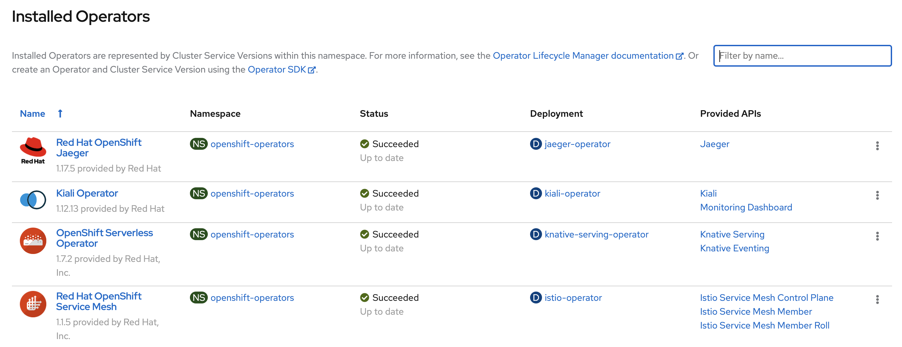
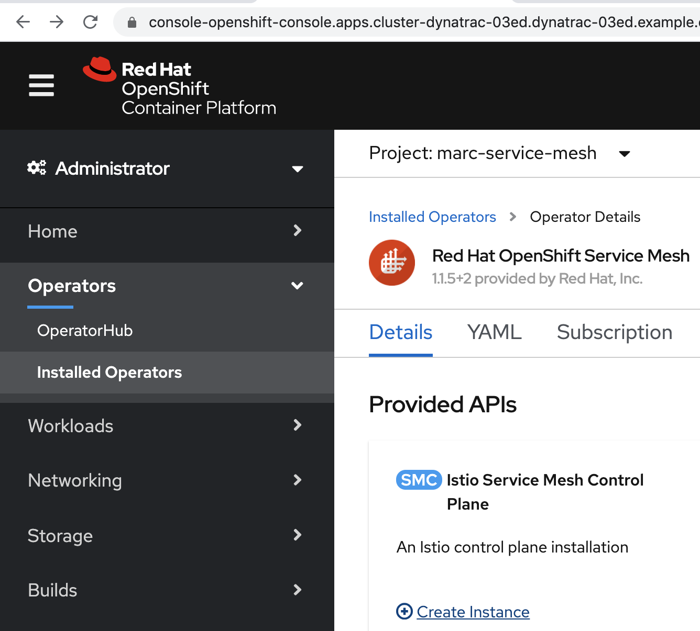
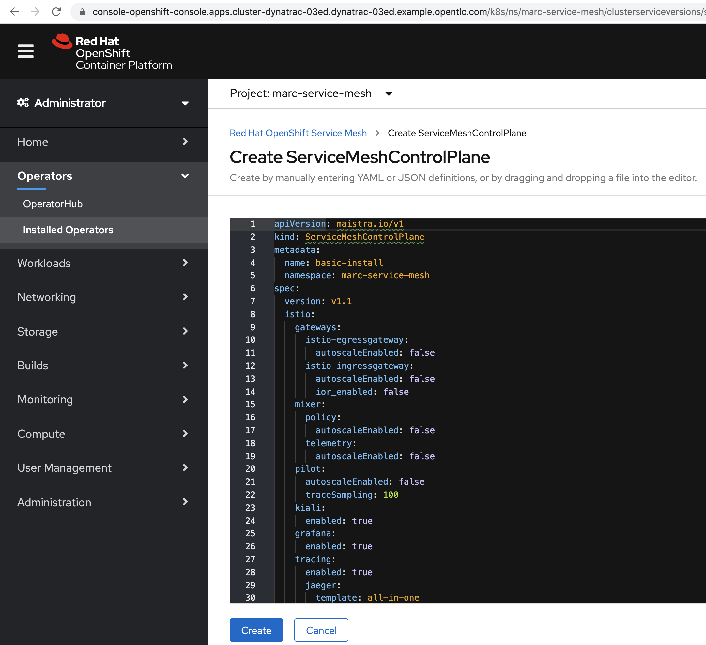
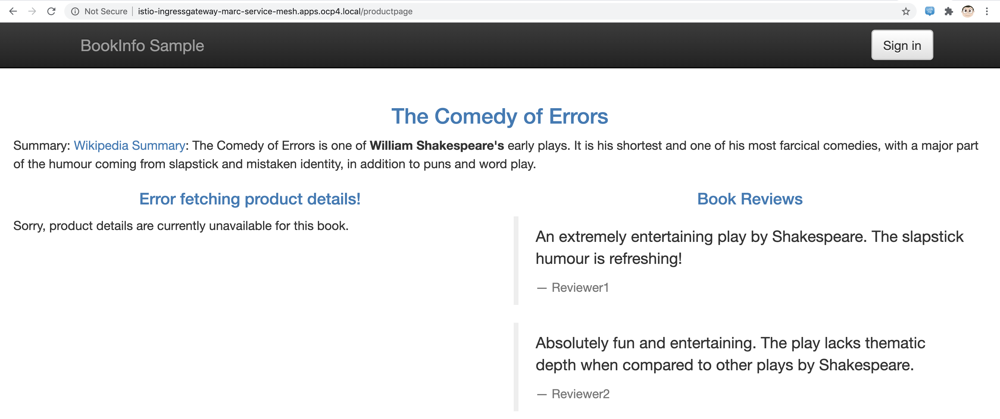
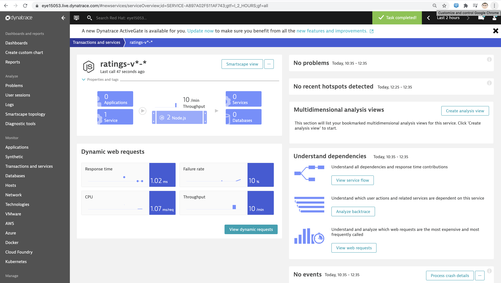
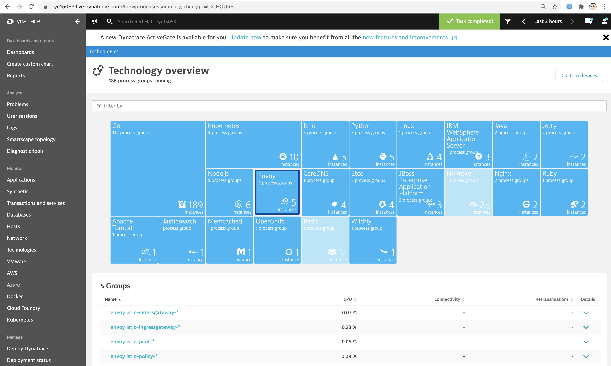

== Service Mesh and Dynatrace

https://www.dynatrace.com/news/blog/automatic-intelligent-observability-into-envoy-proxied-services-of-your-istio-service-mesh-preview/
https://istio.io/latest/docs/examples/bookinfo/

----
oc new-project marc-service-mesh
----

Deploy Jaeger, Kiali and ServiceMesh Operators

----
Create Istio Service Mesh Control Plane in your namespace
----

----
Click on "Create instance"
----

----
Keep all defaults and click "Create"
----

----
Click on "Create instance" under "Istio Service Mesh Member Roll"
Replace namespace with the name of the service mesh control plane project you created
Under members, add the names of the projects where you'll deploy service mesh apps managed by the above control plane.
(With OpenShift Service Mesh, you can have multiple control planes each managing multiple namespaces).
----

----
apiVersion: maistra.io/v1
kind: ServiceMeshMemberRoll
metadata:
  name: default
  namespace: marc-service-mesh
spec:
  members:
    - marc-bookinfo
----

----
oc new-project marc-bookinfo
git clone https://github.com/istio/istio
cd istio/samples/bookinfo/platform/kube
oc project marc-bookinfo
oc create -f bookinfo.yaml
----

----
oc get pods
NAME                              READY   STATUS    RESTARTS   AGE
details-v1-5974b67c8-d5hmk        1/1     Running   0          22s
productpage-v1-64794f5db4-t2zth   1/1     Running   0          22s
ratings-v1-c6cdf8d98-fnv7b        1/1     Running   0          22s
reviews-v1-7f6558b974-x6dtb       1/1     Running   0          22s
reviews-v2-6cb6ccd848-86j5j       1/1     Running   0          22s
reviews-v3-cc56b578-b4c96         1/1     Running   0          22s
----

----
[root@dell-r730-001 kube]# cd ../..
[root@dell-r730-001 bookinfo]# cd networking
oc create -f bookinfo-gateway.yaml
oc create -f bookinfo-gateway.yaml
gateway.networking.istio.io/bookinfo-gateway created
virtualservice.networking.istio.io/bookinfo created
----

----
[root@dell-r730-001 networking]# export GATEWAY_URL=$(oc -n marc-service-mesh get route istio-ingressgateway -o jsonpath='{.spec.host}')
[root@dell-r730-001 networking]# echo "GATEWAY_URL=$GATEWAY_URL"
GATEWAY_URL=istio-ingressgateway-marc-service-mesh.apps.ocp4.local
----

----
oc create -f virtual-service-reviews-jason-v2-v3.yaml
virtualservice.networking.istio.io/reviews created
----

----
Generate traffic
export GATEWAY_URL=$(oc -n marc-service-mesh get route istio-ingressgateway -o jsonpath='{.spec.host}')
[root@dell-r730-001 networking]# echo "GATEWAY_URL=$GATEWAY_URL"
GATEWAY_URL=istio-ingressgateway-marc-service-mesh.apps.ocp4.local
----

----
oc -n marc-service-mesh get service istio-ingressgateway -o jsonpath='{.spec.ports[?(@.name=="http2")].port}'
----

----
cat ./generate-traffic.sh
#!/bin/bash

while [ true ]
do
    curl -o /dev/null -s -w "%{http_code}\n" http://$GATEWAY_URL/productpage
    sleep .1
done
----

----
./generate-traffic.sh
200
200
200
----

