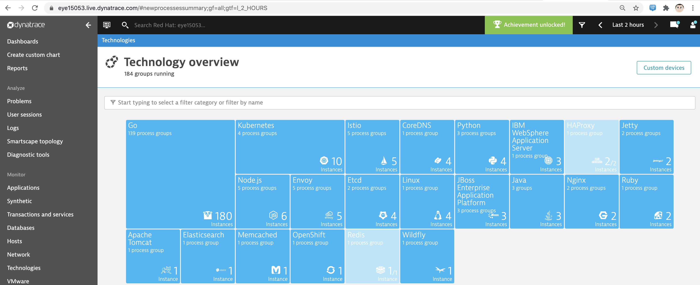
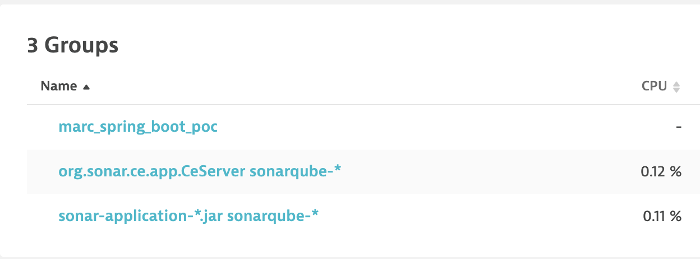
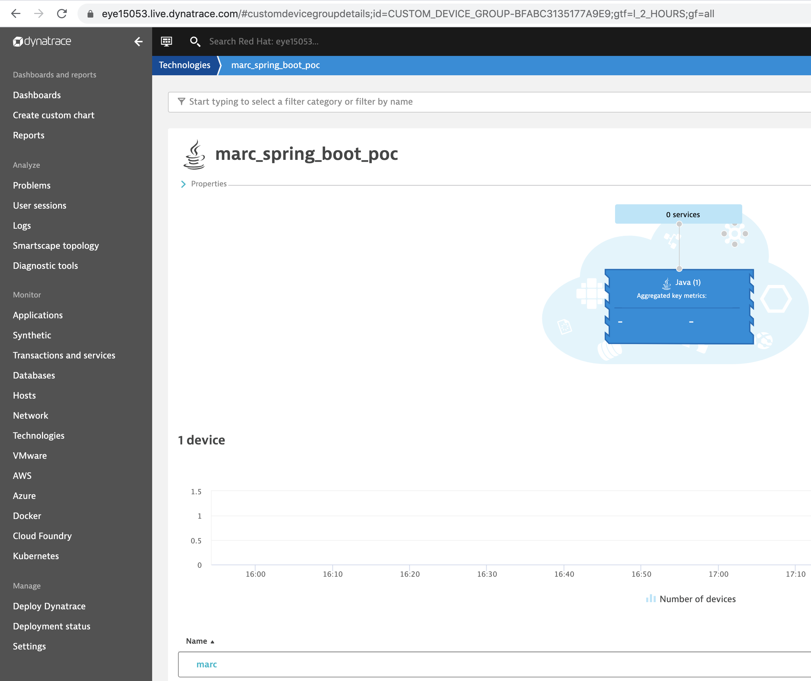
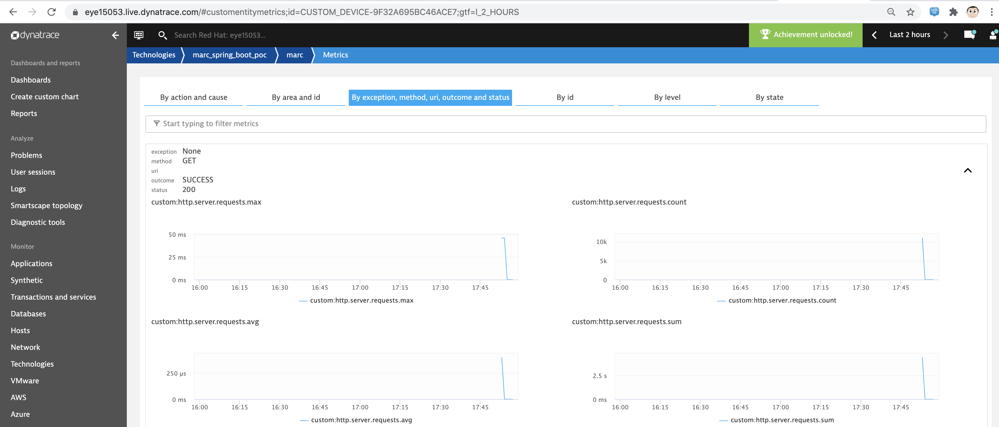

== Publish Spring Boot Actuator custom metrics on Dynatrace

See https://dzone.com/articles/publish-spring-boot-actuator-metrics-on-dynatrace

----
git clone https://github.com/marcredhat/spring-boot-metrics-dynatrace-example.git
cd spring-boot-metrics-dynatrace-example/src/main/resources
----

----
cat application.properties
# Expose the health and metrics endpoints
management.endpoints.web.exposure.include=health, metrics

# The Dynatrace instance URL
management.metrics.export.dynatrace.uri=https://<tenant>.live.dynatrace.com

# The Dynatrace API token generated
management.metrics.export.dynatrace.api-token=<Dynatrace API token>

# The Device ID passed to Dynatrace API (could be an hostname or a pod name)
management.metrics.export.dynatrace.device-id=marc

# The Process Group passed to Dynatrace API (could be the application name)
# Be aware that this property works properly only from Spring Boot 2.2.3.RELEASE
management.metrics.export.dynatrace.group=marc_spring_boot_poc

# The interval at which metrics are sent to Dynatrace (default 1 minute)
management.metrics.export.dynatrace.step=1m

#################################################
### IMPORTANT: Set to true for publishing the ###
###            custom metrics to Dynatrace.   ###
#################################################
management.metrics.export.dynatrace.enabled=true
----

----
cat application.properties | grep marc
management.metrics.export.dynatrace.device-id=marc
management.metrics.export.dynatrace.group=marc_spring_boot_poc
----

----
cd ../../..
mvn spring-boot:run
----

----
ab -n 1000 -c 20  http://localhost:8080/
----

